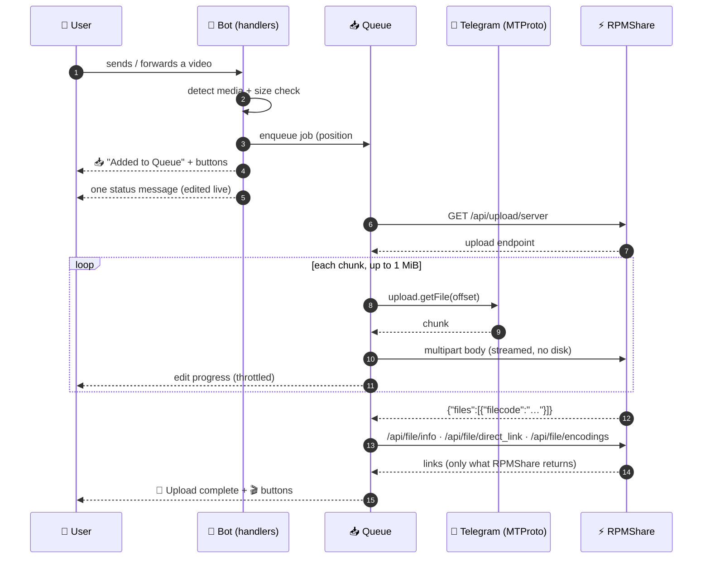

<div align="center">

<pre>
🌊  R P M S T R E A M
</pre>

### Telegram ➜ RPMShare streaming uploader

**Send a video. Watch it stream. Get the link.**
RPMStream reads Telegram media chunk by chunk and pushes it straight into RPMShare —
**the file never touches the disk**, so a 30 GB movie runs happily on a 512 MB VPS.

[](https://www.python.org/)
[](https://core.telegram.org/api)
[](https://docs.aiohttp.org/)
[](#-deploy-with-docker)
[](#-testing)
[](#-why-it-is-different)
[](#-license)
[](#-creator)

**⚡ Fast &nbsp;•&nbsp; 🎨 Interactive &nbsp;•&nbsp; 🪶 Lightweight &nbsp;•&nbsp; 🌊 Stream-first**

</div>

---

## ✨ Why it exists

Most Telegram mirror bots download the whole file to disk and then upload it. On a small
VPS that means a 10 GB video needs 10 GB of free space, a long wait, and a very sad `df -h`.

**RPMStream never does that.** Telegram hands over a 1 MiB chunk, RPMStream immediately
writes it into the RPMShare upload request, and only then asks Telegram for the next one.

```
┌──────────┐    1 MiB chunk     ┌──────────────┐    same 1 MiB    ┌────────────┐
│ Telegram │ ─────────────────► │  RPMStream   │ ───────────────► │  RPMShare  │
│  MTProto │ ◄───── next ────── │  (pipeline)  │ ◄──── ack ────── │    API     │
└──────────┘                    └──────────────┘                  └────────────┘
                                        │
                                 RAM: ~1 chunk
                                 Disk: 0 bytes of video
```

## 🚀 Feature highlights

| | |
|---|---|
| 🌊 **True streaming** | Chunked MTProto reads piped into a streaming `multipart/form-data` body. No temp files, no full-file buffering. |
| 🎯 **Exact `Content-Length`** | Telegram tells us the file size up front, so the multipart frame is computed byte-exact. RPMShare's PHP upload endpoint gets a real length header instead of a chunked body it may reject. |
| 🎬 **Smart media detection** | Videos, animations, videos sent as documents, and forwarded media are all recognised automatically. |
| 🔘 **100% inline-keyboard UI** | Every action — queue, status, cancel, retry, links, creator — is a button. No walls of text, no raw URLs. |
| 📊 **One live message** | A single status message is edited in place with a unicode progress bar, speed and ETA. Throttled to stay far away from Telegram flood limits. |
| 📥 **Real queue** | FIFO ordering, configurable concurrency, positions, per-job cancel, and a worker pool that survives cancellations. |
| 🔁 **Automatic retries** | Exponential backoff with jitter for network blips, 5xx and rate limits. Permanent errors fail fast instead of looping forever. |
| 🧠 **Self-healing** | Expired Telegram file references are re-resolved mid-flight; a deleted status message falls back to a fresh one so the result always arrives. |
| 🎭 **Configurable animations** | Optional animated emoji and sticker ids for startup / success / error — nothing copyrighted is hard coded. |
| 🐳 **Docker ready** | Tiny slim image, non-root user, tmpfs, log rotation, 512 MB memory ceiling. |
| 🧾 **Clean logs, zero secrets** | Rotating logs with an automatic credential scrubber — API keys and tokens never reach the file. |

## 🏗️ Architecture




### Project structure

```
RPMStream/
├── app/
│   ├── main.py                  # wiring + graceful shutdown
│   ├── config/settings.py       # .env → validated, immutable settings
│   ├── bot/
│   │   ├── handlers/            # start · media intake · callback dispatcher
│   │   ├── keyboards/inline.py  # every inline keyboard
│   │   ├── messages/texts.py    # every message template (HTML)
│   │   ├── screens.py           # state → screen mapping
│   │   ├── context.py           # shared runtime state
│   │   └── branding.py          # project + creator links
│   ├── telegram/streamer.py     # MTProto chunk reader (upload.getFile)
│   ├── rpmshare/
│   │   ├── client.py            # documented RPMShare endpoints only
│   │   └── payload.py           # streaming multipart with exact length
│   ├── services/upload_service.py  # pipeline: retries, stages, progress
│   ├── queue/upload_queue.py    # FIFO queue + worker pool + cancel
│   ├── ui/                      # progress rendering · animations · status editor
│   └── utils/                   # formatting · logging · errors
├── tests/                       # 147 tests, incl. a fake RPMShare server
├── logs/                        # rotating logs (never video data)
├── .env.example
├── requirements.txt
├── Dockerfile
├── docker-compose.yml
└── README.md
```

## 🎛️ The interface

**Incoming video → queue**

```
━━━━━━━━━━━━━━━━━━━━
🌊 RPMStream
📥 Added to Queue

📁 Filename: Movie.mp4
📦 Size: 8.4 GB
🆔 Job: 4f1c9ab2
⏳ Queue position: #2 of 3

You will get live updates below 👇
━━━━━━━━━━━━━━━━━━━━
[ 📊 View Queue ]  [ ❌ Cancel ]
[ 🏠 Home ]
```

**Live progress — one message, edited in place**

```
━━━━━━━━━━━━━━━━━━━━
🌊 RPMStream
📁 Movie.mp4

██████████░░░░░░ 62%

📦 6.2 GB / 10.0 GB
⚡ 14.8 MB/s
⏳ ETA: 04:12

✅ ✅ ✅ ⚡ ▫️ ▫️

⚡ Transferring video… ▰▰▱▱
━━━━━━━━━━━━━━━━━━━━
[ 🔄 Refresh Status ]
[ ❌ Cancel Upload ]
```

**Result — links live behind buttons, never in the text**

```
━━━━━━━━━━━━━━━━━━━━
🎉 UPLOAD COMPLETE!

📁 Movie.mp4
📦 10.0 GB
⏱️ 08:31
🆔 4f1c9ab2

✨ Successfully transferred to RPMShare
━━━━━━━━━━━━━━━━━━━━
[ 🎬 Watch Video ]
[ 📺 Open Player (HLS) ]  [ 📥 Normal ]
[ 📋 View Link ]  [ ℹ️ Details ]
[ 🏠 Home ]  [ 🗑️ Close ]
```

**Failure — friendly for the user, technical in the logs**

```
━━━━━━━━━━━━━━━━━━━━
⚠️ Upload Failed

📁 Movie.mp4
Something interrupted the transfer.
The system retries temporary errors automatically.
━━━━━━━━━━━━━━━━━━━━
[ 🔄 Retry ]
[ 🏠 Home ]  [ 🗑️ Close ]
```

**About / Creator**

```
━━━━━━━━━━━━━━━━━━━━
🤖 RPMStream
🌊 Telegram → RPMShare Streaming
⚡ Fast • Interactive • Lightweight
━━━━━━━━━━━━━━━━━━━━
👨‍💻 Created & Developed by
✨ Salman Biswas
━━━━━━━━━━━━━━━━━━━━
🔘 Choose an option below
[ 👨‍💻 Developer Portfolio ]
[ 💬 Telegram ]  [ 📢 Channel ]
[ 🐙 GitHub ]  [ 📸 Instagram ]
[ 🛍️ Store ]  [ 📘 Facebook ]
```

## 🧠 Why it is different

The hard part is not reading from Telegram — it is sending to RPMShare *without* a file.
A `multipart/form-data` POST normally needs either a real file on disk or chunked
transfer encoding (which many PHP upload endpoints refuse).

RPMStream does neither:

1. Telegram reports the exact file size with the media object.
2. The multipart **frame** (boundary, form fields, `Content-Disposition` headers, closing
   boundary) is only a few hundred bytes and is computed up front.
3. `frame + file_size + closing` gives the **exact body length**, so aiohttp sends a real
   `Content-Length` header.
4. The body itself is an async generator: Telegram chunk in ➜ socket write out. At any
   moment at most one chunk is in memory, and chunk *N* is only read after *N‑1* is on the
   wire (asserted by the test suite).

Result: **constant memory, zero video bytes on disk**, and an upload endpoint that sees a
perfectly ordinary `Content-Length` request.

> ⚠️ Honest note: RPMShare has no resumable/chunked upload API — an upload is one POST.
> RPMStream's streaming is real, but a transfer that dies halfway is retried from the start
> (bounded by `MAX_RETRIES`). Nothing is faked: if the API does not support it, we do not
> pretend it does.

## 📡 RPMShare API

Only endpoints from the [official documentation](https://rpmshare.com/apidoc/) are used —
nothing is invented, and no undocumented parameter is sent.

| Endpoint | Used for |
|---|---|
| `GET /api/account/info` | Verify the API key at startup, show storage in **ℹ️ Details** |
| `GET /api/upload/server` | Where the upload must be POSTed (cached 10 min) |
| `POST {upload server}` | The actual file: `key`, `file`, `file_title`, `file_descr`, `tags`, `fld_id`, `cat_id`, `file_public`, `file_adult` |
| `GET /api/file/info` | Title, thumbnail, duration after upload |
| `GET /api/file/direct_link` | Download qualities + HLS manifest (premium capable accounts) |
| `GET /api/file/encodings` | The public page link RPMShare itself reports |
| `GET /api/file/list` · `/api/folder/list` | Picking `RPMSHARE_FOLDER_ID` |
| `GET /api/file/delete` · `/api/file/edit` | Housekeeping helpers |
| `GET /api/upload/url` · `/api/upload/task` | Server-side remote uploads (optional) |

Buttons are rendered **only for URLs RPMShare actually returned** — if your account has no
direct-link access, the completion screen simply shows fewer buttons.

## 🛠️ Installation

### 1 · Bare metal / VPS

```bash
git clone https://github.com/salman-dev-app/RPMStream.git
cd RPMStream

python3 -m venv .venv && source .venv/bin/activate
pip install -r requirements.txt

cp .env.example .env
nano .env            # API_ID, API_HASH, BOT_TOKEN, RPMSHARE_API_KEY

python -m app.main
```

### 2 · Run it in the background

```bash
# systemd-friendly: the bot handles SIGTERM/SIGINT and shuts down cleanly
nohup python -m app.main >> logs/stdout.log 2>&1 &
```

### 🐳 Deploy with Docker

```bash
cp .env.example .env && nano .env
docker compose up -d --build
docker compose logs -f
```

The compose file mounts a **named volume for the session only** (a few KB) and a 32 MB
`tmpfs` for `/tmp`. Video data is never written anywhere. Memory is capped at 512 MB.

### ✅ Verify it works

1. Open Telegram and send `/start` to your bot.
2. Send any short video.
3. Watch the queue screen, then the live progress message, then 🎉 **Upload complete**.

## ⚙️ Configuration

Every option lives in `.env`. Secrets are never hard coded and never logged.

### Required

| Variable | Description |
|---|---|
| `API_ID` | Telegram API id — [my.telegram.org](https://my.telegram.org) |
| `API_HASH` | Telegram API hash |
| `BOT_TOKEN` | Bot token from [@BotFather](https://t.me/BotFather) |
| `RPMSHARE_API_KEY` | RPMShare API key from your account settings |

### Pipeline

| Variable | Default | Description |
|---|---|---|
| `MAX_CONCURRENT_UPLOADS` | `1` | Parallel uploads. Keep low on a small VPS. |
| `CHUNK_SIZE` | `1048576` | Bytes per MTProto read. 64 KiB–1 MiB, multiple of 4096 (auto-aligned). |
| `MAX_RETRIES` | `3` | Retries for temporary failures (backoff + jitter). |
| `RETRY_BASE_DELAY` / `RETRY_MAX_DELAY` | `3` / `60` | Backoff bounds in seconds. |
| `UPLOAD_TIMEOUT` | `0` | Wall-clock cap per transfer, `0` = none. |
| `MAX_FILE_SIZE_MB` | `0` | Reject bigger files early, `0` = unlimited. |
| `QUEUE_MAX_ITEMS` | `250` | Queue capacity before new videos are refused. |
| `ALLOWED_USERS` | *(empty)* | Comma separated user ids. Empty = public bot. |
| `ALLOW_ANY_DOCUMENT` | `false` | Also accept non-video documents (PDFs, archives…). |

### RPMShare

| Variable | Default | Description |
|---|---|---|
| `RPMSHARE_API_BASE` | `https://rpmshare.com` | API base URL. |
| `RPMSHARE_FILE_URL_TEMPLATE` | `https://rpmshare.com/{file_code}` | Fallback watch-page URL. |
| `RPMSHARE_FOLDER_ID` / `RPMSHARE_CATEGORY_ID` | *(unset)* | Destination folder / category. |
| `RPMSHARE_TAGS` | *(unset)* | Comma separated tags. |
| `RPMSHARE_FILE_PUBLIC` / `RPMSHARE_FILE_ADULT` | `true` / `false` | Visibility flags. |
| `RPMSHARE_TITLE_TEMPLATE` | `{file_name}` | Title sent with the upload. |
| `RPMSHARE_POLL_INTERVAL` / `RPMSHARE_POLL_TIMEOUT` | `5` / `180` | Post-upload polling. |

### Interface & logging

| Variable | Default | Description |
|---|---|---|
| `PROGRESS_UPDATE_INTERVAL` | `3` | Seconds between status edits (≥ 1, flood safe). |
| `PROGRESS_BAR_WIDTH` | `16` | Bar width in characters. |
| `BOT_TITLE` / `BOT_TAGLINE` / `CREATOR_NAME` | `RPMStream` / … / `Salman Biswas` | Branding shown in the UI. |
| `ANIMATED_EMOJI_ID` | *(unset)* | Custom animated emoji. Requires a Fragment-linked bot username. |
| `STARTUP_/LOADING_/SUCCESS_/ERROR_STICKER_ID` | *(unset)* | Your own sticker file ids. |
| `SEND_STAGE_STICKERS` | `false` | Master switch for stage stickers. |
| `WORK_DIR` / `SESSION_NAME` | `work` / `rpmstream` | Pyrogram session location (**no video data**). |
| `LOG_LEVEL` / `LOG_FILE` / `LOG_TO_FILE` | `INFO` / `logs/rpmstream.log` / `true` | Logging. Secrets are scrubbed automatically. |

## 🧪 Testing

```bash
pip install -r requirements-dev.txt
python -m pytest -q
```

**147 tests** cover the parts that matter:

- **Streaming payload** — the multipart frame is byte exact, `Content-Length` is declared,
  chunks are flushed strictly in order with **zero look-ahead buffering**, and a length
  mismatch raises instead of silently corrupting an upload.
- **Fake RPMShare server** — a local server speaking the documented API verifies that the
  bytes RPMShare would receive are *identical* to the source, that form fields are correct,
  and that error envelopes map to retry vs. give-up.
- **MTProto reader** — sequential offsets, chunk alignment, short-read termination,
  cancellation between chunks, `FILE_REFERENCE_EXPIRED`, `FloodWait`, CDN redirects.
- **Queue** — FIFO order, concurrency cap, cancel-while-running (and that the worker pool
  survives it), retry-after-cancel, per-user cancel-all, shutdown without deadlock.
- **Pipeline** — retries, permanent vs. transient classification, reference refresh,
  cancellation mid-transfer, speed/ETA derivation.
- **UI** — every screen, keyboard layout, pagination, HTML escaping, and a rule that
  **no creator URL ever leaks into message text**.

## 🩺 Troubleshooting

| Symptom | Fix |
|---|---|
| `Configuration error: Missing required environment variables` | `cp .env.example .env` and fill in the four required values. |
| `RPMShare account check failed` at startup | The API key is wrong or the account is inactive — the bot keeps running and reports it per upload. |
| Uploads fail with `RPMShare rejected this upload` | Permanent error (storage full, file type, key permissions). Check your RPMShare account. |
| Very slow transfers | Raise `CHUNK_SIZE` to `1048576`, check the VPS network, and keep `MAX_CONCURRENT_UPLOADS` low. |
| `FloodWait` in the logs | Normal Telegram rate limiting. RPMStream waits automatically; raise `PROGRESS_UPDATE_INTERVAL` if it repeats. |
| Huge files rejected by Telegram | Telegram caps bot sessions (~2 GB, 4 GB for Premium). Set `MAX_FILE_SIZE_MB` to reject early with a friendly message. |
| Session lost after redeploy | Mount `/app/work` (Docker volume) so the `.session` file survives. |

## 🗺️ Roadmap

- [ ] Album (multi-video) support as one grouped result
- [ ] Optional `upload/url` remote-upload mode for public links
- [ ] Per-chat default folder / category presets
- [ ] Web dashboard for queue monitoring

---

## 👨‍💻 Creator

> **RPMStream** is created and maintained by **Salman Biswas**.

<div align="center">

[](https://github.com/salman-dev-app)
[](https://t.me/Otakuosenpai)
[](https://t.me/salmandevapp)
[](https://profile.vrozek.xyz/)
[](https://vrozek.xyz/)
[](https://www.instagram.com/mdsalman.010)
[](https://facebook.com/salmandevapp)

</div>

### 🙏 Credits

- 🌊 **RPMStream** — concept, design and implementation by **Salman Biswas**
- ⚡ [kurigram](https://github.com/KurimuzonAkuma/pyrogram) — MTProto client for Python
- 🚀 [aiohttp](https://docs.aiohttp.org/) — async HTTP client powering the streamed upload
- 📡 [RPMShare](https://rpmshare.com/) — hosting platform and API

## 📄 License

Released under the MIT License. See [`LICENSE`](LICENSE) for details.

<div align="center">

**© Salman Biswas — RPMStream**

🌊 *Built with care, streamed with love.*

[⬆️ Back to top](#-rpmstream)

</div>
